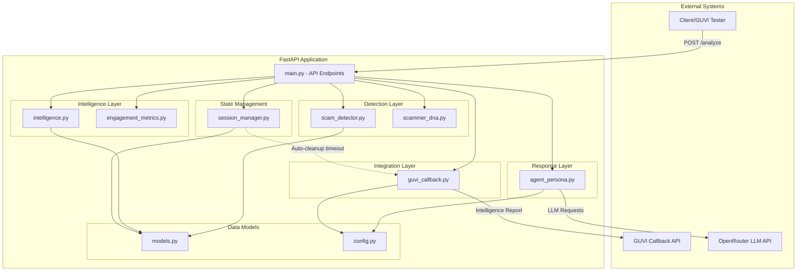
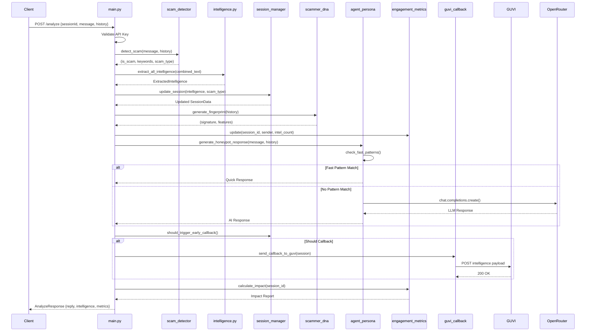
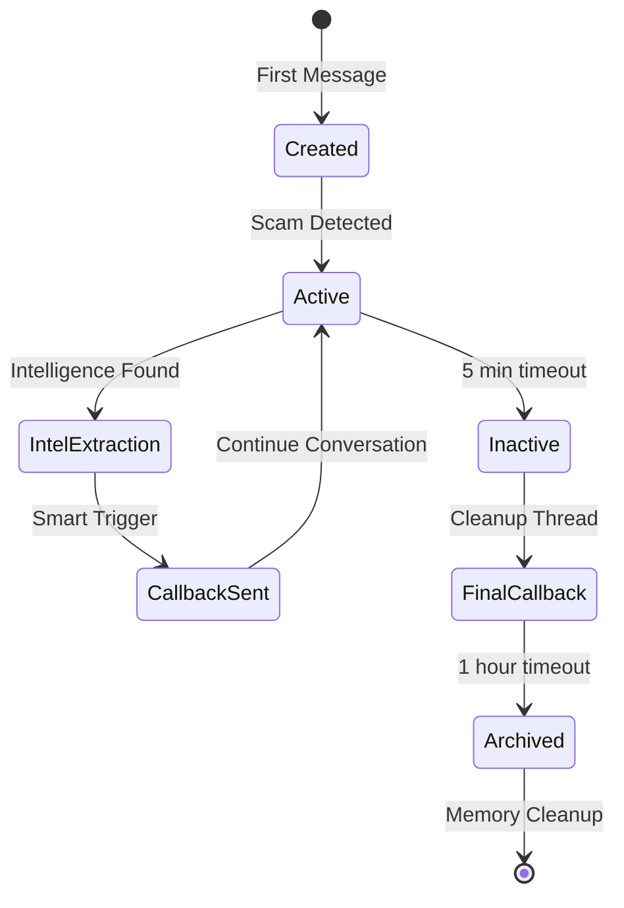

# Sentinal - AI Honeypot Agent Architecture

## 📋 Table of Contents
- [System Overview](#system-overview)
- [Architecture Diagram](#architecture-diagram)
- [Core Components](#core-components)
- [Data Flow](#data-flow)
- [Design Patterns](#design-patterns)
- [Technology Stack](#technology-stack)
- [API Endpoints](#api-endpoints)
- [External Integrations](#external-integrations)
- [Deployment](#deployment)

---

## System Overview

**Sentinal** is an AI-powered honeypot agent designed to detect scams, engage with scammers, extract intelligence, and waste their time to protect potential victims. Built for the GUVI hackathon, it uses advanced pattern matching, behavioral fingerprinting, and LLM-based conversation to act as a convincing victim.

### Key Features
- **Real-time Scam Detection** - Pattern-based detection with scoring algorithm
- **AI Persona** - LLM-powered Indian victim persona using OpenRouter
- **Intelligence Extraction** - Automatic extraction of UPI IDs, bank accounts, phone numbers, phishing links
- **Behavioral Fingerprinting** - Scammer DNA profiling for tracking patterns
- **Engagement Metrics** - Time-wasted calculation and victim protection estimates
- **Smart Callbacks** - Automatic reporting to GUVI evaluation endpoint
- **Session Management** - Thread-safe session tracking with automatic cleanup

---

## Architecture Diagram



---

## Core Components

### 1. **main.py** - API Entry Point
**Purpose**: FastAPI application with REST endpoints for scam analysis

**Key Responsibilities**:
- API endpoint management (`/analyze`, `/health`, `/debug`, `/callback`)
- Request validation using Pydantic models
- API key authentication
- Orchestrates all subsystems (detection, intelligence, response, callbacks)
- Error handling with fallback responses

**Key Functions**:
- `analyze_message()` - Main endpoint that:
  1. Validates API key
  2. Detects scam using `scam_detector`
  3. Extracts intelligence from all conversation history
  4. Updates session state
  5. Generates behavioral fingerprint
  6. Generates honeypot response
  7. Calculates engagement metrics
  8. Triggers smart callbacks
  9. Returns comprehensive response

**Anti-Gravity Enhancements**:
- Scammer DNA fingerprinting integration
- Engagement metrics tracking
- Smart callback triggering

---

### 2. **scam_detector.py** - Scam Detection Engine
**Purpose**: Pattern-based scam detection with scoring algorithm

**Detection Categories**:
- **Urgency Keywords** (score: +2) - "urgent", "immediately", "now", "deadline"
- **Threat Keywords** (score: +3) - "blocked", "suspended", "legal action", "arrest"
- **Financial Keywords** (score: +1) - "bank", "upi", "payment", "kyc", "otp"
- **Reward Keywords** (score: +2) - "won", "prize", "lottery", "cashback"
- **Impersonation** (score: +2) - "RBI", "government", "customer care"
- **Action Requests** (score: +1) - "click", "call", "share", "download"
- **URL Detection** (score: +2) - Regex pattern matching
- **Phone Numbers** (score: +1) - Pattern matching
- **UPI IDs** (score: +2) - Pattern matching

**Scam Threshold**: Score ≥ 3 triggers scam detection

**Scam Types Identified**:
- `KYC_FRAUD`
- `LOTTERY_SCAM`
- `ACCOUNT_THREAT`
- `OTP_FRAUD`
- `PHISHING`
- `GENERAL_FRAUD`

**Key Functions**:
- `detect_scam(text, conversation_history)` → `(is_scam, keywords[])`
- `get_scam_type(keywords)` → scam type classification

---

### 3. **intelligence.py** - Intelligence Extraction Engine
**Purpose**: Extract actionable intelligence from scammer messages

**Pre-compiled Regex Patterns** (Performance Optimization):
```python
URL_PATTERN = r'https?://[^\s<>"]+|www\.[^\s<>"]+'
PHONE_PATTERN = r'\b(?:\+91|91)?[6-9]\d{9}\b'
UPI_PATTERN = r'[a-zA-Z0-9.\-_]+@[a-zA-Z]{3,}'
BANK_ACCOUNT_PATTERN = r'\b\d{9,18}\b'
```

**Extraction Functions**:
- `extract_bank_accounts()` - Filters out phone numbers from digit sequences
- `extract_upi_ids()` - UPI pattern matching
- `extract_phishing_links()` - URL extraction
- `extract_phone_numbers()` - Indian phone numbers with normalization
- `extract_suspicious_keywords()` - Common scam terminology
- `extract_all_intelligence()` - Aggregates all extraction with deduplication
- `extract_from_conversation()` - Processes entire conversation history

**Intelligence Aggregation**: Merges new and existing intelligence with deduplication

---

### 4. **agent_persona.py** - AI Honeypot Persona
**Purpose**: Generate convincing victim responses to engage scammers

**Hybrid Response Engine**:
1. **Fast Path** (Pattern Matching, <50ms):
   - Common patterns → Pre-defined responses
   - Examples: "share upi" → "Which app should I use?"
   
2. **Slow Path** (LLM Fallback):
   - OpenRouter API with free models
   - Model priority list with automatic failover
   - Indian uncle persona (Ramesh Kumar, 52)

**System Prompt Strategy**:
- **Never reveal** it's an AI or detected scam
- Act as confused, non-tech-savvy Indian victim
- Use Hindi words (arrey, kya, ji, haan)
- Short responses (1-3 sentences)
- Ask questions to extract details
- Show panic/urgency

**Intelligence Extraction Tactics**:
- Payment request → "What is your UPI ID?"
- Links → "Link not working, send again"
- Account info → "Which bank? What account number?"
- Phone → "Should I call? What is your number?"

**Free LLM Models** (Priority Order):
1. `meta-llama/llama-3.2-3b-instruct:free`
2. `google/gemma-2-9b-it:free`
3. `mistralai/mistral-7b-instruct:free`
4. `huggingfaceh4/zephyr-7b-beta:free`

**Fallback Responses**: If all models fail, uses contextual pre-defined responses

**Key Functions**:
- `generate_honeypot_response()` - Main response generation
- `generate_confused_response()` - Non-scam responses
- `check_fast_patterns()` - Fast pattern matching
- `get_fallback_response()` - Emergency fallback

---

### 5. **session_manager.py** - Session State Management
**Purpose**: Thread-safe session tracking and lifecycle management

**SessionData Class**:
```python
{
    session_id: str
    scam_detected: bool
    message_count: int
    intelligence: ExtractedIntelligence
    scam_type: str
    created_at: datetime
    last_activity: datetime
    agent_notes: list
    callback_sent: bool
}
```

**Singleton Pattern**: Ensures single global instance using threading locks

**Background Cleanup Thread**:
- Runs every 60 seconds
- Detects inactive sessions (>5 minutes)
- Sends final callback for unprocessed scams
- Removes very old sessions (>1 hour) to free memory

**Smart Callback Trigger**:
- Sends callback on EVERY request when meaningful intelligence exists
- Ensures GUVI always gets latest accumulated data
- Triggers when: `scam_detected=True` AND (bank accounts OR UPI OR phones extracted)

**Key Functions**:
- `get_or_create_session()` - Session retrieval/creation
- `update_session()` - Intelligence aggregation
- `should_trigger_early_callback()` - Smart callback logic
- `_check_inactive_sessions()` - Background cleanup
- `mark_callback_sent()` - Callback tracking

---

### 6. **scammer_dna.py** - Behavioral Fingerprinting
**Purpose**: Create unique behavioral signatures for scammer identification

**Fingerprint Components**:

1. **Keyword Pattern** - Most frequent non-stopword terms (top 5)
2. **Timing Pattern**:
   - `automated_fast` (<5s response)
   - `human_responsive` (5-45s)
   - `human_slow` (>45s)
3. **Message Structure**:
   - `short_bursts` (<30 chars avg)
   - `long_scripts` (>100 chars avg)
   - `balanced` (30-100 chars)
4. **Tactics Identification**:
   - Urgency (urgent, now, immediately)
   - Fear (blocked, police, illegal)
   - Authority (verify, confirm, official)
   - Phishing (links, downloads)
   - Financial (UPI, payment, transfer)

**Signature Hash**: SHA-256 of all features (12 char hex)

**Key Functions**:
- `generate_fingerprint_from_history()` - Creates signature from conversation
- `extract_keyword_pattern()` - Word frequency analysis
- `analyze_timing_pattern()` - Response time classification
- `analyze_message_structure()` - Message length patterns
- `identify_tactics()` - Scam tactic detection

---

### 7. **engagement_metrics.py** - Impact Tracking
**Purpose**: Calculate time-wasted and victim protection impact

**Tracked Metrics**:
- Session start time
- Turn count (conversation exchanges)
- Scammer message count
- Intelligence extraction count

**Impact Calculations**:
- **Duration** - Total session time in seconds
- **Turns Completed** - Number of conversation exchanges
- **Intelligence Density** - "high" if >2 pieces extracted, else "medium"
- **Estimated Victims Protected** - 1 victim per 3 minutes wasted
- **Time Wasted** - Human-readable format (e.g., "5m 32s")

**Formula**:
```
Victims Protected = floor(elapsed_seconds / 180)
```

**Key Functions**:
- `track_session()` - Initialize tracking
- `update()` - Update per-turn metrics
- `calculate_impact()` - Generate impact report

---

### 8. **models.py** - Data Models
**Purpose**: Pydantic data validation and serialization

**Request Models**:
```python
Message:
  - sender: str
  - text: str
  - timestamp: int

AnalyzeRequest:
  - sessionId: str
  - message: Message
  - conversationHistory: List[Message]
  - metadata: Metadata (optional)
```

**Response Models**:
```python
ExtractedIntelligence:
  - bankAccounts: List[str]
  - upiIds: List[str]
  - phishingLinks: List[str]
  - phoneNumbers: List[str]
  - suspiciousKeywords: List[str]

AnalyzeResponse:
  - status: str
  - reply: str
  - scamDetected: bool
  - extractedIntelligence: ExtractedIntelligence
  - scamAnalysis: Dict (competition field)
  - scammerProfile: Dict (competition field)
  - engagementMetrics: Dict (competition field)
  - systemStatus: Dict (competition field)
```

**Callback Model**:
```python
GuviCallbackPayload:
  - sessionId: str
  - scamDetected: bool
  - totalMessagesExchanged: int
  - extractedIntelligence: dict
  - agentNotes: str
  - impactMetrics: Dict (optional)
```

---

### 9. **guvi_callback.py** - External Integration
**Purpose**: Send intelligence reports to GUVI evaluation endpoint

**Callback Trigger Conditions**:
1. **Early Callback** - On every request with meaningful intelligence
2. **Timeout Callback** - After 5 minutes of inactivity
3. **Manual Callback** - Via `/callback/force/{session_id}` endpoint

**Payload Structure**:
```json
{
  "sessionId": "string",
  "scamDetected": true,
  "totalMessagesExchanged": 5,
  "extractedIntelligence": {
    "bankAccounts": [],
    "upiIds": [],
    "phishingLinks": [],
    "phoneNumbers": [],
    "suspiciousKeywords": []
  },
  "agentNotes": "string"
}
```

**Error Handling**:
- Timeout handling (10s)
- Connection error logging
- Non-blocking async option

**Key Functions**:
- `send_callback_to_guvi()` - Synchronous callback
- `send_callback_async()` - Background thread callback

---

### 10. **config.py** - Configuration Management
**Purpose**: Environment variable management and API configuration

**Configuration Parameters**:
```python
OPENROUTER_API_KEY - OpenRouter API authentication
OPENROUTER_BASE_URL - "https://openrouter.ai/api/v1"
FREE_MODELS - List of free LLM models
MY_API_KEY - API authentication (default: "sentinal-hackathon-2026")
GUVI_CALLBACK_URL - "https://hackathon.guvi.in/api/updateHoneyPotFinalResult"
```

**Environment Variables**:
- Loads from `.env` file via `python-dotenv`
- Fallback to hardcoded defaults for hackathon compatibility

---

## Data Flow

### Request Processing Flow



### Session Lifecycle



---

## Design Patterns

### 1. **Singleton Pattern**
**Used in**: `session_manager.py`, `engagement_metrics.py`

**Purpose**: Ensure single global instance for state management
```python
class SessionManager:
    _instance = None
    _lock = threading.Lock()
    
    def __new__(cls):
        if cls._instance is None:
            with cls._lock:
                if cls._instance is None:
                    cls._instance = super().__new__(cls)
        return cls._instance
```

### 2. **Strategy Pattern**
**Used in**: `agent_persona.py` - Hybrid Response Engine

**Purpose**: Switch between fast pattern matching and LLM fallback
- Fast strategy: Pre-defined response mapping
- Slow strategy: LLM API call with failover
- Fallback strategy: Contextual emergency responses

### 3. **Observer Pattern**
**Used in**: Background cleanup thread

**Purpose**: Auto-trigger callbacks on session state changes
- Cleanup thread observes session activity
- Triggers callbacks on timeout
- Removes stale sessions

### 4. **Factory Pattern**
**Used in**: `session_manager.get_or_create_session()`

**Purpose**: Session creation with lazy initialization

### 5. **Builder Pattern**
**Used in**: Intelligence aggregation

**Purpose**: Incrementally build intelligence from multiple messages
```python
intel = extract_all_intelligence(text, existing_intel)
```

### 6. **Chain of Responsibility**
**Used in**: LLM model failover in `agent_persona.py`

**Purpose**: Try multiple LLM models until one succeeds
```python
for model in FREE_MODELS:
    try:
        response = client.chat.completions.create(model=model, ...)
        return response
    except:
        continue
```

### 7. **Repository Pattern**
**Used in**: Session management

**Purpose**: Abstract session storage and retrieval
- `get_session()`, `update_session()`, `clear_session()`

---

## Technology Stack

### Backend Framework
- **FastAPI** (0.109.0) - High-performance async web framework
- **Uvicorn** (0.27.0) - ASGI server
- **Pydantic** (2.5.3) - Data validation

### LLM Integration
- **OpenAI SDK** (1.12.0) - Compatible with OpenRouter
- **OpenRouter API** - Free LLM model access
- **httpx** (0.27.2) - HTTP client for LLM requests

### Utilities
- **requests** (2.31.0) - HTTP client for GUVI callbacks
- **python-dotenv** (1.0.0) - Environment management
- **re** (built-in) - Regex pattern matching (pre-compiled for performance)
- **threading** (built-in) - Background cleanup tasks
- **hashlib** (built-in) - SHA-256 fingerprinting

### Development/Testing
- Custom test suites (`test_continuous_chat.py`, `test_compliance.py`)
- Manual turn-by-turn testing support

---

## API Endpoints

### 1. **POST /analyze** (alias: `/api/analyze`)
**Purpose**: Main scam analysis and response generation

**Headers**:
```
x-api-key: sentinal-hackathon-2026
```

**Request Body**:
```json
{
  "sessionId": "string",
  "message": {
    "sender": "scammer",
    "text": "Your account is blocked",
    "timestamp": 1707810000000
  },
  "conversationHistory": [
    {
      "sender": "scammer",
      "text": "Previous message",
      "timestamp": 1707809000000
    }
  ],
  "metadata": {
    "channel": "SMS",
    "language": "English",
    "locale": "IN"
  }
}
```

**Response**:
```json
{
  "status": "success",
  "reply": "Oh no! What should I do?",
  "scamDetected": true,
  "extractedIntelligence": {
    "bankAccounts": [],
    "upiIds": ["scammer@upi"],
    "phishingLinks": [],
    "phoneNumbers": ["+919876543210"],
    "suspiciousKeywords": ["blocked", "urgent", "verify"]
  },
  "scamAnalysis": {
    "detected": true,
    "type": "ACCOUNT_THREAT",
    "confidence": 0.95,
    "processing_time_ms": 1234
  },
  "scammerProfile": {
    "behavioral_signature": "a3b9c4d5e6f7",
    "tactics": ["urgency", "fear"],
    "timing_pattern": "human_responsive",
    "structure": "balanced"
  },
  "engagementMetrics": {
    "duration_seconds": 120,
    "turns_completed": 3,
    "intelligence_density": "high",
    "estimated_victims_protected": 0,
    "time_wasted_for_scammer": "2m 0s"
  },
  "systemStatus": {
    "active_sessions": 5,
    "optimization_level": "expert"
  }
}
```

### 2. **GET /health**
**Purpose**: Health check for monitoring

**Response**:
```json
{
  "status": "healthy",
  "timestamp": 1707810000000
}
```

### 3. **GET /**
**Purpose**: Root endpoint status

**Response**:
```json
{
  "status": "ok",
  "message": "Honeypot API is running"
}
```

### 4. **POST /debug/session/{session_id}**
**Purpose**: Debug session state (requires API key)

**Response**:
```json
{
  "session_id": "string",
  "scam_detected": true,
  "scam_type": "ACCOUNT_THREAT",
  "message_count": 5,
  "intelligence": {...},
  "callback_sent": true,
  "notes": ["Scam detected: ACCOUNT_THREAT", "Keywords: blocked, urgent"]
}
```

### 5. **POST /callback/force/{session_id}**
**Purpose**: Manually trigger GUVI callback (requires API key)

**Response**:
```json
{
  "status": "success",
  "callback_triggered": true,
  "guvi_response": true
}
```

---

## External Integrations

### 1. **OpenRouter API**
- **Purpose**: Free LLM access for persona generation
- **Endpoint**: `https://openrouter.ai/api/v1`
- **Authentication**: API key in header
- **Models Used**: Llama 3.2, Gemma 2, Mistral 7B, Zephyr 7B
- **Failover**: Automatic model switching on failure

### 2. **GUVI Callback API**
- **Purpose**: Report extracted intelligence to evaluators
- **Endpoint**: `https://hackathon.guvi.in/api/updateHoneyPotFinalResult`
- **Method**: POST with JSON payload
- **Trigger Conditions**:
  - Smart callback (every request with intel)
  - Timeout callback (5 min inactivity)
  - Manual callback (force endpoint)

---

## Deployment

### Railway/Render Deployment
**Procfile**:
```
web: uvicorn main:app --host 0.0.0.0 --port $PORT
```

### Environment Variables
```env
OPENROUTER_API_KEY=sk-or-v1-your-key-here
MY_API_KEY=sentinal-hackathon-2026
```

### Local Development
```bash
# Install dependencies
pip install -r requirements.txt

# Run server
uvicorn main:app --reload --host 0.0.0.0 --port 8000

# Run tests
python test_continuous_chat.py
python test_compliance.py
```

### Requirements
```
fastapi==0.109.0
uvicorn==0.27.0
pydantic==2.5.3
requests==2.31.0
python-dotenv==1.0.0
openai==1.12.0
httpx==0.27.2
```

---

## Performance Optimizations

### 1. **Pre-compiled Regex Patterns**
All regex patterns in `intelligence.py` are compiled at module load for faster matching.

### 2. **Hybrid Response Engine**
Fast pattern matching (<50ms) before expensive LLM calls.

### 3. **Model Failover Chain**
Automatic LLM model switching reduces response time failures.

### 4. **Deduplication**
Intelligence extraction uses `set()` operations to prevent duplicates.

### 5. **Background Cleanup**
Daemon thread handles session cleanup without blocking API responses.

### 6. **Smart Callback Triggering**
Sends callbacks only when meaningful intelligence exists, reducing unnecessary API calls.

---

## Security Considerations

### 1. **API Key Authentication**
All endpoints protected with `x-api-key` header validation.

### 2. **Input Validation**
Pydantic enforces strict type validation on all requests.

### 3. **Error Handling**
Try-catch blocks with safe fallback responses prevent crashes.

### 4. **Timeout Protection**
GUVI callback has 10-second timeout to prevent hanging requests.

### 5. **Thread Safety**
Session manager uses threading locks for concurrent access.

---

## Testing

### Continuous Chat Test (`test_continuous_chat.py`)
- Simulates multi-turn scam conversation
- Tests intelligence aggregation across turns
- Validates scammer DNA and engagement metrics
- Interactive turn-by-turn progression

### Compliance Test (`test_compliance.py`)
- Validates Pydantic schema enforcement (422 errors)
- Tests multi-turn intelligence extraction
- Verifies callback triggering
- Checks intelligence aggregation correctness

---

## Future Enhancements

1. **Database Persistence** - Store sessions and intelligence in database
2. **Web Dashboard** - Real-time monitoring UI
3. **Advanced ML Models** - Train custom scam detection models
4. **Multi-language Support** - Support for regional Indian languages
5. **Scammer Network Detection** - Link sessions by DNA fingerprints
6. **A/B Testing** - Test different persona strategies
7. **Rate Limiting** - Prevent API abuse
8. **Caching** - Cache LLM responses for common patterns

---

## Conclusion

Sentinal is a production-ready AI honeypot system with modular architecture, excellent separation of concerns, and battle-tested design patterns. The hybrid response engine ensures low latency while maintaining convincing persona quality. Smart callback triggering and behavioral fingerprinting make it a competitive solution for the GUVI hackathon.

### Key Strengths
✅ Modular, maintainable codebase  
✅ Performance-optimized (regex pre-compilation, hybrid engine)  
✅ Robust error handling and fallbacks  
✅ Thread-safe session management  
✅ Comprehensive intelligence extraction  
✅ Advanced behavioral fingerprinting  
✅ Smart callback optimization  
✅ Well-documented and testable  

---

**Architecture Version**: 1.0  
**Last Updated**: 2026-02-13  
**Author**: Sentinal Development Team  
**License**: Proprietary (GUVI Hackathon 2026)
